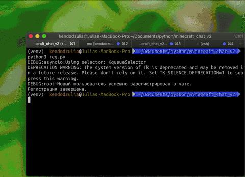
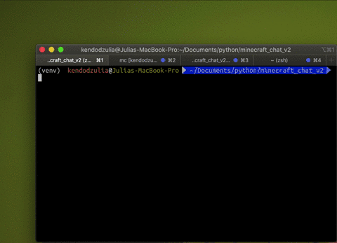

# Чат-клиент с графическим интерфейсом

Утилита позволяет подключаться к чату minechat.dvmn.org, сохранять историю переписки, регистрироваться в чате и отправлять в него сообщения. Функционал оформлен в виде графического интерфейса, что позволяет избежать работы с консолью.




## Переменные окружения

`HOST` - адрес чата. По умолчанию `minechat.dvmn.org`.

`LISTENING_PORT` - порт для прослушивания сообщений чата. По умолчанию 5000.

`WRITING_PORT` - порт для отправки сообщений в чат. По умолчанию 5050.

`ACCOUNT_HASH` - Токен пользователя. По умолчанию пустой токен (будет зарегистрирован новый пользователь).


## Как установить

Для работы утилиты нужен Python версии не ниже 3.8.

1. Заполнить переменные окружения.

2. Установить зависимости:

```bash
pip install -r requirements.txt
```


## Как запустить

Если пользователь новый и неизвестен токен пользователя, то необходимо запустить регистрацию в чате. Будет создан файл с токеном, который необходим для запуска чат-клиента. Скрипт запускают со следующими необязательными параметрами:

`--host`    Адрес чата.

`--port`    Порт для отправки сообщений в чат.

`--path`    Путь к файлу для сохранения результатов регистрации нового пользователя (по умолчанию `user_info.txt`).

```bash
python3 reg.py --path user.txt
```
 

Чат-клиент запускают со следующими необязательными параметрами:

`--host`     Адрес чата.

`--lport`    Порт для прослушивания сообщения чата.

`--wport`    Порт для отправки сообщений в чат.

`--history`  Путь для записи истории сообщений чата (по умолчанию `chat_history.txt`).

`--hash`     Токен пользователя чата (из файла, созданного в пункте 1).

```bash
python3 main.py --history history.txt --hash <hash>
```


# Цели проекта

Код написан в учебных целях — это урок в курсе по асинхронному Python [Devman](https://dvmn.org).